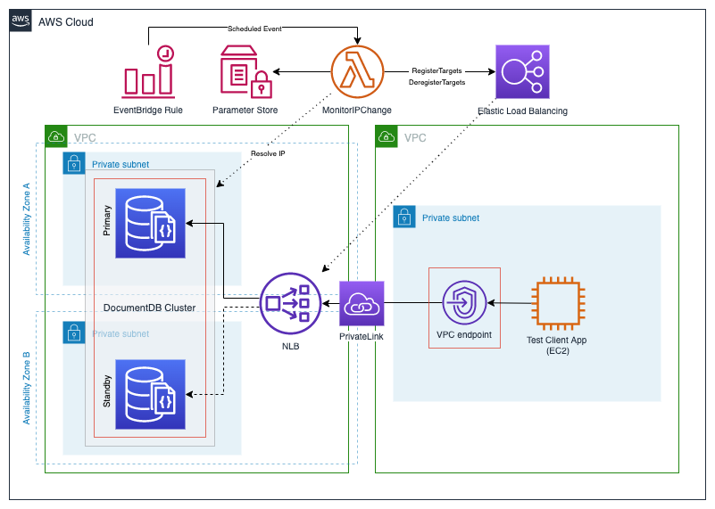

# Connecting to DocumentDB across VPC

This project demonstrates a technique to connect to a DocumentDB cluster using VPC endpoint service
from across another VPC, without using VPC peering. 

# Architecture

The following diagram shows the design implemented in this project: 
  
[Figure 1: AWS architecture diagram showing DocumentDB access across VPC](diagram.png)

# TODO

Following required features have not been implemented in this project as yet: 

1. Implement a Lambda function to detect for DocumentDB cluster IP address changes and update NLB targets
